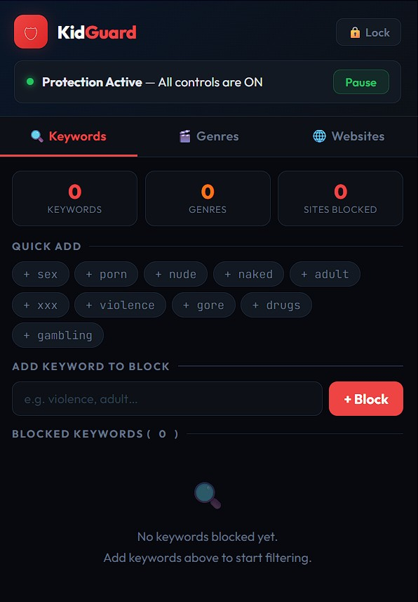
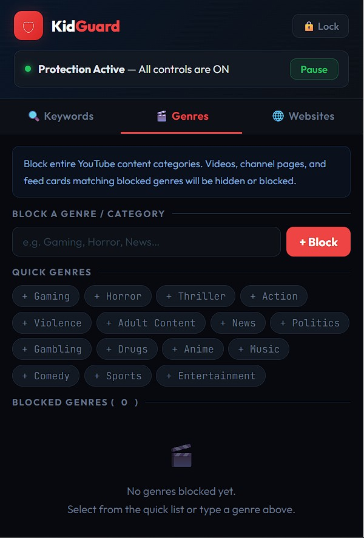
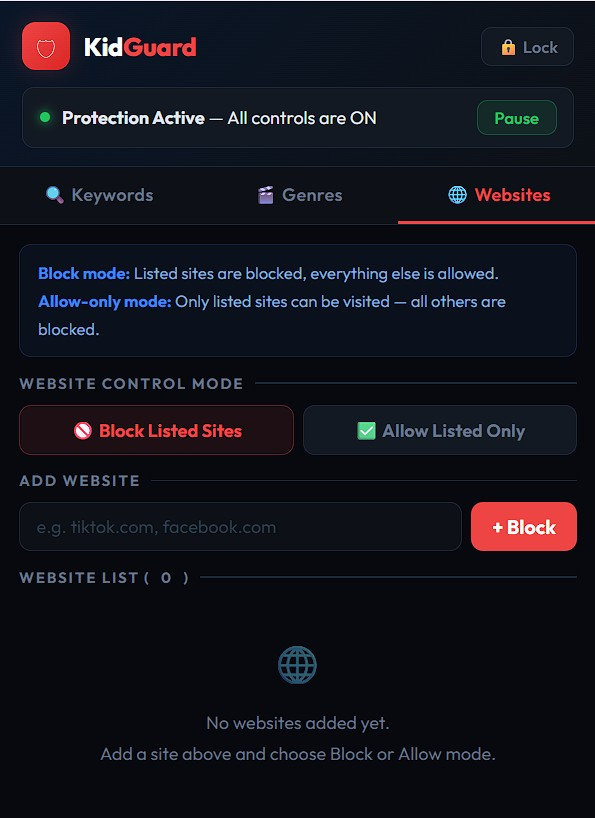
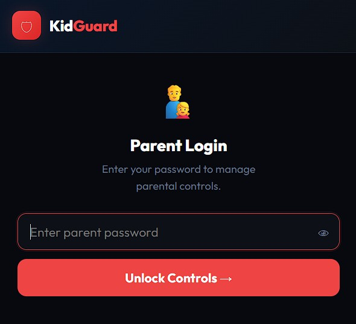
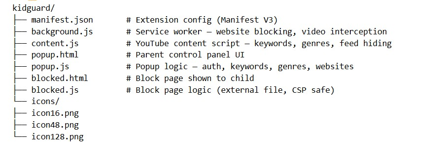

# 🛡 KidGuard — Parental Control Chrome Extension

A powerful, password-protected Chrome extension that gives parents full control over their child's browsing experience — blocking inappropriate YouTube content, entire websites, and content genres.

<h3 style="margin: 0px; font-size: 18px; font-weight: 600; color: rgb(26, 26, 26); line-height: 1.3; overflow: hidden; text-overflow: ellipsis; white-space: nowrap;"> KidGuard — Parental Control</h3>
Better Control

<a href="https://www.producthunt.com/products/kidguard-parental-control?embed=true&amp;utm_source=embed&amp;utm_medium=post_embed" target="_blank" rel="noopener" style="display: inline-flex; align-items: center; gap: 4px; margin-top: 12px; padding: 8px 16px; background: rgb(255, 97, 84); color: rgb(255, 255, 255); text-decoration: none; border-radius: 8px; font-size: 14px; font-weight: 600;">Check it out on Product Hunt →</a>

---
# Project Screenshots

<table>
  <tr>
    <td></td>
    <td></td>
    <td></td>
  </tr>
  <tr>
    <td></td>
    <td></td>
  </tr>
  </table>

## ✨ Features

### 🔐 Password Protected
- Set a parent-only password on first launch
- All settings are locked behind authentication
- Children cannot access, modify, or disable any controls

### 🔍 YouTube Keyword Blocker
- Block specific words or phrases from being searched on YouTube
- Blocks search submissions in real time — before the search even runs
- Hides video cards from the feed and search results that contain blocked words
- Intercepts video clicks before the page loads using YouTube's oEmbed API to check titles
- Works on YouTube's single-page app — catches navigation without full page reloads

### 🎬 YouTube Genre Blocker
- Block entire content categories like Gaming, Horror, News, Music, Anime, Violence, and more
- 15 quick-add genre presets built in
- Hides genre filter chips from the YouTube homepage bar
- Blocks genre category page navigation
- Hides video cards tagged with blocked genres

### 🌐 Website Blocker
Two modes:

| Mode | Behaviour |
|---|---|
| **Block Listed Sites** | Add specific websites to block — everything else is accessible |
| **Allow Listed Only** | Only whitelisted websites can be visited — all others are blocked |

- Blocking happens before the page loads — no content is ever shown
- Works across all tabs in real time
- Custom block page shown with clear messaging for the child

### 📊 Live Dashboard
- Stats bar shows total keywords, genres, and blocked sites at a glance
- Global on/off toggle to temporarily pause all controls
- Lock button to secure the popup after making changes

---

## 🚀 Installation

> KidGuard is not on the Chrome Web Store. Install it manually in Developer Mode.

1. Download and extract the ZIP file
2. Open Chrome and go to `chrome://extensions/`
3. Enable **Developer Mode** (toggle in the top-right corner)
4. Click **Load unpacked**
5. Select the extracted `kidguard` folder
6. The KidGuard shield icon appears in your Chrome toolbar

---

## 🔧 How to Use

### First Launch
1. Click the KidGuard icon in the toolbar
2. Set a parent password (minimum 6 characters)
3. You are taken directly to the control panel

### Adding Keyword Blocks
1. Go to the **YouTube Keywords** tab
2. Type a word in the input field or click a quick-add preset
3. Click **+ Block** — the keyword is active immediately

### Blocking a Genre
1. Go to the **Genres** tab
2. Click a preset (Gaming, Horror, etc.) or type a custom genre
3. Click **+ Block** — genre blocking is active immediately on YouTube

### Blocking a Website
1. Go to the **Website Control** tab
2. Choose **Block Listed Sites** or **Allow Listed Only** mode
3. Type a domain (e.g. `tiktok.com`) and click **+ Add**
4. The site is blocked instantly across all tabs

### Locking the Panel
Click the **🔒 Lock** button in the header — the popup requires the parent password to reopen.

---

## 🛠 Technical Details

| Property | Value |
|---|---|
| Manifest Version | V3 |
| Permissions | `storage`, `tabs`, `scripting`, `webNavigation` |
| Website blocking | `webNavigation.onBeforeNavigate` — fires before page loads |
| Video title check | YouTube oEmbed API (no API key required) |
| SPA navigation | `onHistoryStateUpdated` catches YouTube's pushState routing |
| Feed hiding | `MutationObserver` with retry logic for lazy-loaded cards |
| Password storage | SHA-256 hashed via `SubtleCrypto` — never stored in plain text |
| CSP compliance | No inline scripts or `onclick` handlers — all external JS files |

---

## 📁 File Structure

---

## ⚠️ Limitations

- Works on **Google Chrome** and **Microsoft Edge** (Chromium-based browsers only)
- YouTube's UI changes frequently — genre and feed card detection may need updates over time
- A determined teenager with Developer Mode access could remove the extension — for full enforcement use Chrome managed policies via Windows Group Policy
- Does not block YouTube content loaded inside iframes on third-party sites

---

## 🔒 Privacy

- No data is ever sent to any external server
- All settings (keywords, genres, blocked sites, password hash) are stored locally using Chrome's `storage.sync` API
- The parent password is hashed with SHA-256 before storage and cannot be recovered

---

## 📄 License

MIT License — free to use, modify, and distribute.

---

*Built with ❤️ for parents who want simple, effective browser controls without complexity.*
